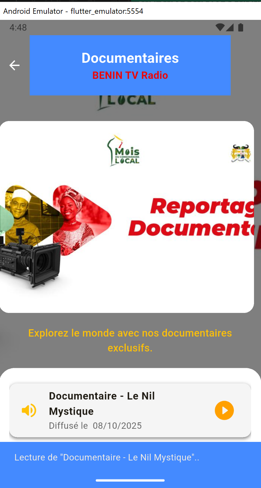
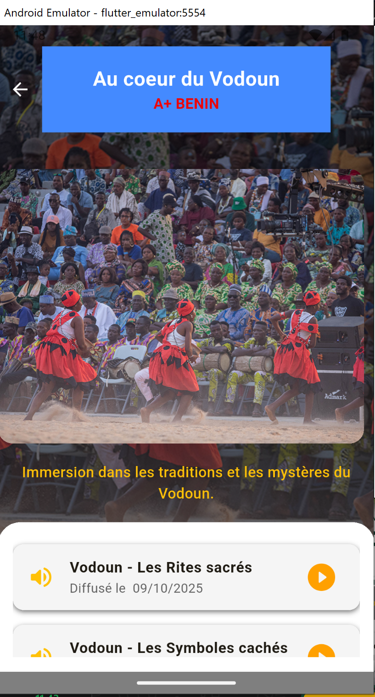

# 🎯 eStreaming
« Application d'émissions de streaming » vise comme objectif de créer une application mobile Flutter qui affiche une liste d'émissions de streaming avec des détails sur chaque émission.
C'est une application Flutter moderne et intuitive, conçue pour offrir une expérience fluide et agréable.  

---

## 🖼️ Aperçu du Projet

  
  
  
  

> *Aperçu rapide de l’interface principale, du menu et des écrans clés de l’application.*

---

## 🚀 Fonctionnalités principales

- 📱 Interface responsive et fluide
- 📱 Accueil: présente la grille des émissions de façon esthétique
- 📱 Détail  de chaque émission: présente les détails de chaque émission
- 🔍 Barre de recherche fonctionnelle  [à venir ] 
- 🗂️ Catégorisation dynamique des éléments [à venir ]
- ⭐ Gestion des favoris [à venir ]
- 🌙 Thème clair / sombre  [à venir ]
- 🔔 Système de notifications intégré [à venir ]

### 🛠️ Technologies utilisées

Flutter (Framework mobile)

Dart (Langage de programmation)

Firebase / API REST (selon le cas)

Git & GitHub (Contrôle de version)

---

## ⚙️ Installation & Exécution

### 1️⃣ Cloner le dépôt

git clone https://github.com/elegbede01/estreaming.git 

### 2️⃣ Se déplacer dans le projet 

# cd ton-repo 

### 3️⃣ Installer les dépendances

flutter pub get 

### 4️⃣ Lancer l’application

flutter run

👨‍💻 Auteur
Ir Joseph ELEGBEDE
💼 Développeur mobile et web  & analyste en Cybersécurité
📍 Bénin
🌐 LinkedIn: https://www.linkedin.com/in/joseph-elegbede-987998186/ 
 | GitHub: https://github.com/elegbede01 